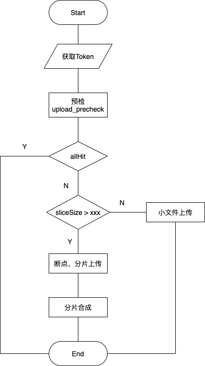
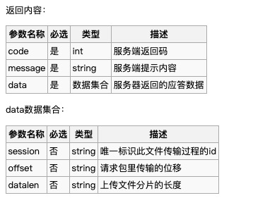
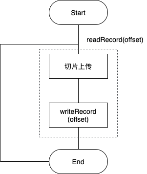

---
layout:post
title:"深入理解视频上传及断点续传"
date:2020-07-30 19:30
header-img:"image/web/post-bg-2018-08-24.jpg"
catalog:true
tags:
- 文件上传
---

## 大文件分片上传及断点续传

> 本文中实现方案使用Rx + OkHttp 实现

### 一、概述

在文件上传过程中，可根据文件大小使用简单上传（`Simple Upload`）或者大文件上传（分片上传&断点续传），如果上传文件大小未知，则使用流式上传。

<font color="orange">`简单上传`</font> 适用于一次HTTP请求交互即可完成上传场景，比如小文件（<= 4MB）的上传；

<font color="orange">`大文件上传`</font> 适用于大文件，分片多次HTTP请求交互，断点续传，上传后切片组装成为完整文件场景；

* 断点续传：中途暂停之后，可从上次上传完成Part位置继续上传；
* 分片上传：将上传文件分为若干切片，上传时采用 `multipart/form-data` 实现，上传结束后将切片重新组合成完整文件；

<font color="orange">`流式上传`</font> 上传文件大小未知，如视频监控、直播等；

### 二、参数

#### 2.1 Multipart/form-data
用于连接消息体的多个部分构成一个消息，POST请求，支持多参数多文件，上传内容为二进制。

```
--11286958-fc05-4278-8f5d-09474d9f6f33
Content-Disposition: form-data; name="op"
Content-Length: 17

upload_slice_data
--11286958-fc05-4278-8f5d-09474d9f6f33
Content-Disposition: form-data; name="session"
Content-Length: 28

THFMb3NUbXNMTlRtc1BvdVRvbQ==
--11286958-fc05-4278-8f5d-09474d9f6f33
Content-Disposition: form-data; name="offset"
Content-Length: 7

1048576
--11286958-fc05-4278-8f5d-09474d9f6f33
Content-Disposition: form-data; name="filecontent"; filename="c59ceb20b8f44cd48227730ef02ab6f9.mp4"
Content-Type: application/octet-stream

��bF���U�|�J3?Ul��$u|��ʁ���Vc�	L�-���n'�]D�?��d�oN%��o��~͵2k;�&��=?��ߒ�3����|Q6y
```

其中  `--11286958-fc05-4278-8f5d-09474d9f6f33` 用来分割数据边界，自动生成随机字符串，自动识别作为边界。`Content-Disposition` 作为消息头，在Multipart body声明内容以`form-data`展现（Web浏览器中，可作为`inline`、`attachment`），以及参数名key，`Content-Length` 声明value值长度，`Content-Type` 用于指示资源的MIME类型`media-type`（text、image、audio、video、application二进制数据）。

#### 2.2 RandomAccessFile

可读取文件内容，向文件输出数据；可自由访问文件任意位置，不需要从头读到尾；支持“随机访问”，允许自由定义文件记录指针；

|名称|注解|
|---|---|
|seek(long pos)|设置当前文件读写偏移量，基于文件起始位置|
|read(byte b[], int off, int len)||
|write(byte b[], int off, int len)||

#### 2.3 Sink&Source

Square下的Okio库，补充java.io和java.nio；可理解为InputStream和OutputStream，定义了一系列写入缓存区，读取缓存区方法；

| 名称                    | 注解                                    |
| ----------------------- | --------------------------------------- |
| writeAll(Source source) | source写入缓存区，返回值: source总bytes |
| source(File file)       | 输入流，转换为Source                    |

#### 2.4 sha1

数据加密算法，将明文转换为散列值【[详解 SHA1 实现](https://blog.csdn.net/ZCShouCSDN/article/details/84675235)】，用来校验文件唯一性

### 三、大文件上传

文件上传实质是将文件变成二进制输入流，将输入流所有byte上传到Server端，即上传成功。输入流上传操作中可以将输入流分成若干byte[]数组来上传，每次上传一定长度的byte[]数组，即切片上传，从某一固定位置，上传byte[]数组，即断点续传。



大文件上传主要实现方案： Multipart/form-data支持、Server端支持分片上传/分片合成、断点续传支持

#### 3.1 切片上传

主要实现点：

* 文件切片
* 计算切片偏移量offset，切片sha1值，各切片byte
* 构造切片上传请求、切片合成请求

本文主要实现方式是基于OKHttp封装，OKHttp3已支持Multipart能力，如若使用HttpUrlConnection，需自己手动实现拼接数据。【[从原理角度解析Android （Java） http 文件上传](https://blog.csdn.net/lmj623565791/article/details/23781773)】

文件切片计算，获取文件的总字节数file.length()，自定义分片大小slice_size，切片上传时，通过每次移动偏移量offset，从0 ~ file.length，最终将文件分成若干切片，进行上传。每次切片上传需携带Server下发的 `token` 进行验证。

```
private WosSliceUploadOffsetResp sliceFile(String auth, String session, int offset) throws Throwable {
        final RandomAccessFile randomAccessFile = new RandomAccessFile(mFileConfig.file, "r");
        final int fileSize = (int) file.length();
        WosSliceUploadOffsetResp currentOffsetResp = null;
        for (; offset < fileSize; offset += sliceSize) {
            if (isCanceled()) {
                return new WosSliceUploadOffsetResp(WosConstants.CODE_CANCEL, "cancel by user", session, offset, -1);
            }
            
            try {
            		RequestPair requestPair = generateSliceUploadRequest(auth, session, randomAccessFile, offset);
                mOkHttpCall = getOkHttpClient().newCall(requestPair.request);
                Response response = mOkHttpCall.execute();
                currentOffsetResp = new WosSliceUploadOffsetResp(new JSONObject(response.body().string()));
            } catch (Throwable e) {
                exception = e;
        		}
        return currentOffsetResp;
    }
```


切片上传请求，需构造MultipartBody，添加form-data若干参数，添加 `offset`、`filecontent`、`filename` 告知服务端本次切片上传到远端文件名，二进制文件内容，以及分片的偏移量。

```
private RequestPair generateSliceUploadRequest(final String auth, final String session, 		final RandomAccessFile randomAccessFile, final int offset) throws IOException, JSONException, NoConnectionError {
        if (!NetworkHook.getInstance().isConnected()) {
            throw new NoConnectionError();
        }
        final int fileLeftSize = (int) (file.length() - offset);
        final int maxReadSize = fileLeftSize < sliceSize ? fileLeftSize : sliceSize;
        MultipartBody requestBody = new MultipartBody.Builder()
                .setType(MultipartBody.FORM)
                .addFormDataPart("op", "upload_slice_data")
                .addFormDataPart("session", session)
                .addFormDataPart("offset", String.valueOf(offset))
                .addFormDataPart("filecontent", uniqueName(), new RequestBody() {
                    @Override
                    public MediaType contentType() {
                        return WosConstants.MIME;
                    }

                    @Override
                    public void writeTo(BufferedSink bufferedSink) throws IOException {
                        randomAccessFile.seek(offset);
                        byte[] buf = new byte[4096];
                        int len = -1, countSize = 0, remainSize = 0;
                        while (countSize <= maxReadSize) {
                            if (isCanceled()) {
                                break;
                            }
                            remainSize = maxReadSize - countSize;
                            if (remainSize == 0) {
                                break;
                            }
                            len = remainSize > buf.length ? buf.length : remainSize;
                            len = randomAccessFile.read(buf, 0, len);
                            if (len == -1) {
                                break;
                            }

                            bufferedSink.write(buf, 0, len);
                            bufferedSink.flush();
                        }
                    }
                }).build();

        okhttp3.Request request = new okhttp3.Request
                .Builder()
                .url(mFileConfig.uploadUrl())
                .headers(headers)
                .post(requestBody)
                .build();
        return new RequestPair(request, offset + maxReadSize);
    }
```

切片上传后返回数据格式



在切片上传后，需发送切片合成请求，通知Server端，将已上传的若干切片，根据偏移量 `offset`  合成完整的数据流，转换为远端存储的文件，返回服务器端存储地址serverUrl。


#### 3.2 断点上传

在上传/下载时，将上传或者下载文件，碰到网络故障或者中断行为，可从已经上传/下载部分继续开始上传/下载未完成的部分。

##### 3.2.1 HTTP支持断点续传

HTTP 1.1中默认支持获取文件内容，通过 <font color="green">`Range`</font> 和  <font color="green">`Content Range`</font> ，客户端发请求对应的Range ,服务端对应的是 Content-Range 

##### 3.2.2 实现方案




切片上传成功后，本地文件记录切片偏移量 `offset` ，上传时间，切片大小`slicesize` 等信息，等到网络恢复或者重新上传时，直接读取本地文件记录，从上次切片上传中止的地方重新上传剩余切片。

#### 3.3 上传进度

主要实现点：

* RandomAcessFile随机读取上传文件
* BufferedSink写入数据流

上传进度依赖于 `RequestBody`，通过构建  `RequestBody`  在回调可实时更新上传进度。每一切片Request请求中，添加form-data数据，使用  `addFormDataPart`  添加二进制输入流，在RequestBody回调中，可动态计算数据流上传进度。使用 `RandomAccessFile` 的seek()和read()方法，随机读取上传文件的某一长度总字节数，与此同时保持向服务端写入此总字节数，以此计算上传进度。

```
private RequestPair generateSliceUploadRequest(){

		final int fileLeftSize = (int) (file.length() - offset);
		final int maxReadSize = fileLeftSize <sliceSize ? fileLeftSize : sliceSize;

		MultipartBody requestBody = new MultipartBody.Builder()
				.addFormDataPart(
						"filecontent",filename,new RequestBody(){
		
								@Override
								public void writeTo(BufferedSink bufferedSink) throws IOException {
										randomAccessFile.seek(offset);
										byte[] buf = new byte[4096];
    								int len = -1, countSize = 0, remainSize = 0;
    								while (countSize <= maxReadSize) {
       									int remainSize = maxReadSize - countSize;
        								if (remainSize == 0) {
        										break;
         								}
        								len = remainSize > buf.length ? buf.length : remainSize;
        								len = randomAccessFile.read(buf, 0, len);
        								if (len == -1) {
        										break;
        								}

        								bufferedSink.write(buf, 0, len);
        								bufferedSink.flush();
        								countSize += len;

        								int writtenBytes = offset + countSize;
       									//if (mIsBreakPointUpload) {
        								//	writtenBytes = mUploadedCountSize + countSize;
        								//}
        								final int hasWrite = writtenBytes;
        								notifyUi(new Runnable() {
        										@Override
            								public void run() {
            										if (mFileConfig.uploadListener != null) {
                										uploadListener.onProgress(mUploadResult.build(), (int) 
                												hasWrite, (int) mFileConfig.file.length());
                						}
                				}
                		});
            }
				}).build();
}
```

大分片连续上传时：上传进度 = offset + 当前BufferedSink.write()的byte数 

小文件上传时：上传进度 = BufferedSink.write() 的byte 累加


### 4 上传优化

#### 4.1 秒传预检功能

即对于相同内容的文件或分片可以不再进行重复上传。通过计算文件或切片的sha1值，使用预检接口与服务端存储的文件或切片sha1值做比对，成功则返回serverUrl，否则继续正常上传流程。

#### 4.2 秒传+上传进度

服务端支持秒传预检功能后，可从预检接口返回结果得到所有上传失败的切片，再次进行上传。此时需要重新计算上传进度，上传进度 = 已上传成功切片总数据长度 (<font color="orange">`datalen`</font>) + 当前切片上传中BufferedSink.write()的总byte数

#### 4.3 Accept-Encoding/Content-Encoding

`accept-encoding` 是request headers头部参数，告诉服务器支持压缩格式（`gzip`、`deflate`）; `content-encoding` 是response headers头部参数，表示需要根据content-encoding值对HTTP请求返回体Response进行解码；一般经过gzip压缩的文本，只有原始大小的1/4；

#### 4.4 并发上传+秒传预检

将文件分为若干切片，使用线程池(一定数目的线程)，每个线程上传单一切片(切片偏移量、切片byte数、切片sha1)，设置重试次数，轮询所有线程上传所有切片，记录上传失败的切片。下次继续上传时，针对sha1做校验，将上传失败的切片重新上传即可。注意点：需要server端支持可根据切片文件名及偏移量做所有切片合成整个文件。【上传的瓶颈在上行带宽，可能不会出现很多个切片一起上传情况，需要实际测试制定线程数目】

---

[Android 实现大文件分片上传](http://lastwarmth.win/2019/07/12/multi-form/?nsukey=UsCQx5x2pETa%2BBjIS4VVj9DNF5qBRKCuYiqWdCQhUBTHPeOW991XwxuTwYCFpmecZnyAucWZWJBW3tpHvnndnobso9hGrJcixy3homShtBo4XlRtsQ9UzQ7BG9gafVMq3ozlEVNNEvqwumDnX8x2j2F6mQ2uNCkk7RrjD9hO3Yk%2Be1bhRpUWQaOaEyJCbt3051%2F8xY3GabqZ4SzVUP8JyA%3D%3D)

[上传文件multipart/form-data深入解析](https://juejin.im/post/6844903810079391757)

[WebUploader 文件上传优化总结](https://my.oschina.net/kisshua/blog/701606)
