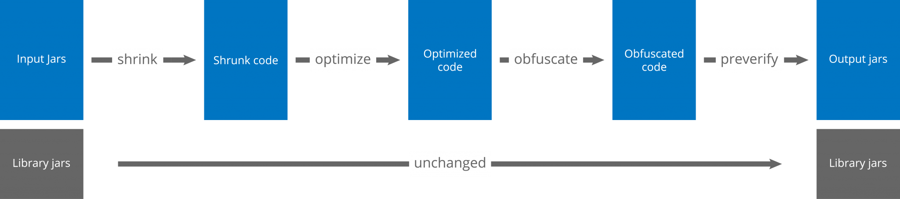

---
layout:post
title:"Proguard运行原理"
date:2020-12-04-30 15:25
header-img:"image/native/application_protection_proguard.png"
catalog:true
tags:
- Proguard
---

### 一、概述
`Proguard`是2002年由程序员Eric Lafortune发布的一款开源工具，用于压缩、混淆、优化、预校验Java字节码，适用于Java和Android应用程序，目标是让程序体积更小、运行更快。主要包括以下模块：`Shriker`(压缩器)、`Optimizer`(优化器)、`Obfuscator`(混淆器)、`Retrace`(堆栈反混淆)、`Preveirfy`(预校验)。

Shrinker: 通过引用标记，移除未使用的classes、resources、resource files和 native libraries.

Optimize: 

Obfuscated:

### 二、Proguard运行
使用Proguard，先看下Proguard运行流程如下，其中其中input.jars / output.jars也可以是其他文件格式（aars、wars、ears、zips、apks or directories）。

官方提供的`Proguard`运行流程图，分别对应输入与输出，`proguard`对输入的文件(input.jars)经过

### 三、Shrinker-压缩器 